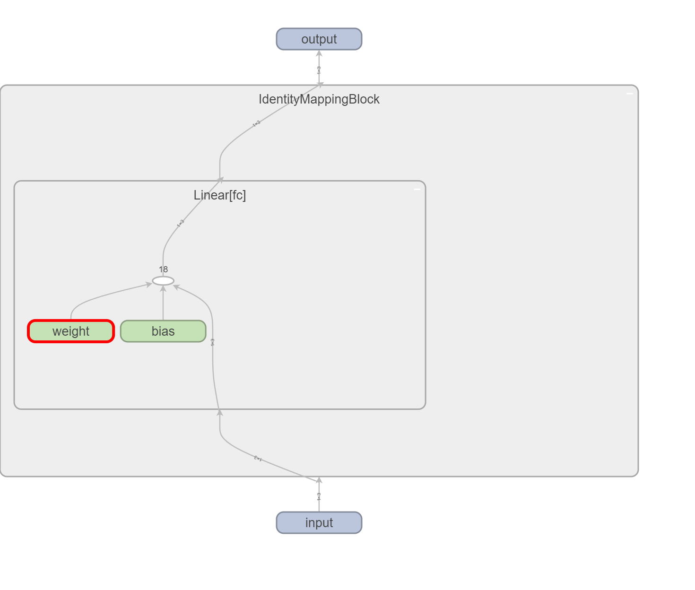

# [殘差網路（Residual Network, ResNet）](https://arxiv.org/pdf/1512.03385)

殘差網路（Residual Network, ResNet）是由微軟研究院的何恆毅等人在2015年提出的一種深度學習模型，它在深度學習中的重要性不言而喻，因為它成功地解決了深度網絡訓練中的退化問題，並且使得可以構建更深層的神經網絡。ResNet 的關鍵創新是引入了殘差塊（Residual Block），這種結構允許信息在層之間更有效地傳遞。

## **核心概念**

### **恆等映射（Identity Mapping)**

在深度神經網絡中，隨著網絡深度的增加，模型的性能有可能變差，這是由於梯度消失和梯度爆炸問題導致的。恆等映射是一種簡單的方法，如果我們將輸入直接傳遞到輸出，則模型的性能應該至少不會變差。然而，實驗表明，單純依賴恆等映射來訓練深層神經網絡在實際操作中是非常困難的。

### **殘差映射（Residual Mapping）**

ResNet 的關鍵創新是引入了殘差映射，模型不直接學習輸入 $ x $ 到目標輸出 $ H(x) $ 的映射，而是學習從輸入 $ x $ 到殘差 $ \mathcal{F}(x) = H(x) - x $ 的映射，這樣做的目的是使得模型只需學習如何將殘差調整為零，即 $\mathcal{F}(x) = 0$，這樣輸出就會等於輸入 $ x $，從而實現恆等映射。數學上，這可以表示為：

$$ H(x) = \mathcal{F}(x) + x $$

### **快捷連接（Shortcut Connections）**

快捷連接（Shortcut Connection）也稱為跳躍連接，它是指直接將輸入信息傳遞到後面的層，而不經過中間的變換層。這樣做的目的是保證信息可以更有效地傳遞，並且避免了深層網絡中的梯度消失問題。

## 殘差塊（Residual Block）

### **基本殘差塊**

一個基本的殘差塊由兩個卷積層組成，每個卷積層之後都接批量歸一化（Batch Normalization）和 ReLU 激活函數。數學上，基本殘差塊可以表示為：

$$
\begin{aligned}
\mathbf{z}_1 &= \text{ReLU}(\text{BN}_1(\mathbf{W}_1 \mathbf{x} + \mathbf{b}_1)) \\
\mathbf{z}_2 &= \text{BN}_2(\mathbf{W}_2 \mathbf{z}_1 + \mathbf{b}_2) \\
\mathbf{y} &= \text{ReLU}(\mathbf{z}_2 + \mathbf{x})
\end{aligned}
$$

其中，$\mathbf{W}_1$ 和 $\mathbf{W}_2$ 是卷積層的權重矩陣，$\mathbf{b}_1$ 和 $\mathbf{b}_2$ 是偏置項。

### **瓶頸殘差塊（Bottleneck Residual Block）**

對於非常深的網絡，為了減少計算量和參數量，ResNet 使用了瓶頸設計。瓶頸殘差塊由三個卷積層組成：第一個卷積層用來減少維度，第二個卷積層用來進行卷積操作，第三個卷積層用來恢復維度。數學上，瓶頸殘差塊可以表示為：

$$
\begin{aligned}
\mathbf{z}_1 &= \text{ReLU}(\text{BN}_1(\mathbf{W}_1 \mathbf{x} + \mathbf{b}_1)) \\
\mathbf{z}_2 &= \text{ReLU}(\text{BN}_2(\mathbf{W}_2 \mathbf{z}_1 + \mathbf{b}_2)) \\
\mathbf{z}_3 &= \text{BN}_3(\mathbf{W}_3 \mathbf{z}_2 + \mathbf{b}_3) \\
\mathbf{y} &= \text{ReLU}(\mathbf{z}_3 + \mathbf{x})
\end{aligned}
$$


## **恆等映射（Identity Mapping）**

### **恆等映射的動機**

恆等映射的目的是確保在某些層中，即使這些層沒有學到任何東西，輸入也能夠直接傳遞到輸出。這樣可以避免因為網絡過深而導致的性能退化問題。然而，單純依賴恆等映射在實際應用中很難實現，因為訓練過程中權重和偏置項很容易偏離理想的狀態。

### **恆等映射網絡的設計**

學習一個恆等映射的網絡看似多餘，因為輸入等於輸出，似乎沒有學到任何有用的特徵。然而，理解這種網絡的設計及其背後的動機可以幫助我們更好地理解深度學習中特定結構的目的，例如 ResNet 中的殘差塊。這些網絡設計的目的是為了解決更深層次的問題，而不僅僅是簡單的輸入等於輸出。

雖然單純依賴恆等映射的網絡在理論上可以確保輸入等於輸出，但這樣的網絡在實際應用中難以有效學習有用的特徵。然而，理解恆等映射的概念對於理解更複雜的網絡結構（如 ResNet）非常有幫助。ResNet 通過引入殘差塊，使得網絡能夠有效地學習複雜的特徵，同時解決了深層網絡中的梯度問題。這些創新使得 ResNet 成為深度學習中非常成功和廣泛應用的模型之一。

### **恆等映射網絡的動機和好處**

1. **解決退化問題**：
   - 深層網絡在訓練時會遇到退化問題，即隨著網絡層數的增加，訓練誤差反而增加。恆等映射的引入確保即使增加更多層，網絡的性能也不會變差，因為如果這些層什麼都沒學到，輸入會直接被傳遞到輸出。

2. **緩解梯度消失和梯度爆炸問題**：
   - 在深層神經網絡中，梯度消失和梯度爆炸是常見問題。快捷連接（shortcut connections）或殘差塊允許梯度直接傳遞到前面幾層，減少了梯度消失或爆炸的可能性。

3. **提高訓練效率**：
   - 當網絡學習的是輸入和輸出之間的差異（即殘差），而不是整體映射時，每一層只需學習小的變化，這樣會使得訓練過程更為簡單和高效。

4. **增強網絡的表達能力**：
   - 恆等映射允許深層網絡學習更多的特徵，特別是當數據中存在複雜的模式時。即使某些層什麼都沒學到，它們也不會對整體模型造成負面影響，因為輸入可以直接被傳遞到輸出。

### **為什麼單純的恆等映射在實際應用中效果不好**

1. **缺乏非線性變換**：
   - 單純的恆等映射沒有引入非線性激活函數，這使得網絡無法學習複雜的非線性關係。深度神經網絡的強大之處在於其非線性變換能力，可以逼近任意複雜的函數。

2. **學習目標單一**：
   - 如果每一層都僅僅學習如何保持輸入不變，網絡實際上沒有學到數據中的模式或特徵。這樣的網絡在處理複雜任務時無法取得好的效果。

### **為什麼這樣的網絡難以訓練**

1. **梯度消失和梯度爆炸問題**：
   - 雖然每一層初始化為恆等映射，但隨著反向傳播過程的進行，權重和偏置會被更新，很容易偏離理想的恆等映射，特別是在深層網絡中，梯度可能會消失或爆炸。

2. **缺乏非線性變換**：
   - 沒有非線性激活函數，這意味著網絡只能學習線性變換，無法逼近複雜的非線性函數。

3. **學習複雜特徵的限制**：
   - 單純依賴恆等映射無法學習數據中的複雜特徵，這使得網絡的表現非常有限。

### **ResNet 的創新**

ResNet 通過引入殘差塊來解決上述問題。在殘差塊中，網絡學習的是殘差而不是直接學習輸入到輸出的映射。數學上，這可以表示為：

$$ H(x) = \mathcal{F}(x) + x $$

其中，$\mathcal{F}(x)$ 是要學習的殘差函數。這樣設計的好處在於：

1. **有效學習特徵**：
   - 每一層只需學習輸入和輸出之間的小差異（殘差），這使得每一層的學習目標更加明確和簡單。

2. **保持非線性變換**：
   - 殘差塊仍然使用非線性激活函數，這使得網絡能夠學習和表達複雜的非線性關係。

3. **穩定梯度傳遞**：
   - 殘差塊中的快捷連接使得梯度可以更穩定地傳遞到前面的層，從而緩解梯度消失或爆炸問題。

### **更簡單的解釋**

使用恆等映射（identity mapping）的主要目的是確保即使在某些層沒有學到任何新的特徵，輸入 $ \mathbf{x} $ 也能夠被直接傳遞到輸出。這可以有效地解決深層網絡中的退化問題。以下是對這一點的更簡單解釋：

1. **確保信息的傳遞**：
   - 當模型在某一層學不到任何有用的特徵時，即 $\mathcal{F}(x) = 0$，輸入 $ \mathbf{x} $ 仍然可以通過快捷連接（shortcut connection）直接傳遞到輸出。這樣，輸出 $ H(x) $ 仍然等於輸入 $ \mathbf{x} $，確保信息不丟失。
   - 數學上，這可以表示為：
     $$
     H(x) = \mathcal{F}(x) + x
     $$
     當 $\mathcal{F}(x) = 0$ 時，$ H(x) = x $。

2. **緩解梯度消失問題**：
   - 快捷連接允許梯度直接傳遞到前面的層，減少了梯度消失的可能性，從而穩定了深層網絡的訓練過程。
  
### **但並不希望每一個模塊都是恆等函數**

我們期望的是大部分模塊能夠學到有用的特徵，而不是僅僅學到恆等映射。理想情況下，殘差塊應該學習到輸入和目標輸出之間的差異（即殘差），從而提高模型的表現能力。

### **結論**

通過引入恆等映射和殘差塊，ResNet 能夠有效地解決深層網絡中的退化和梯度消失問題。這使得即使在非常深的網絡中，信息也能夠穩定地傳遞，從而提升了模型的訓練效率和性能。

總結來說，恆等映射的核心思想是：即使某層沒有學到任何東西，輸入也能夠通過快捷連接被傳遞到輸出，從而確保信息不丟失，網絡性能不會退化。

# 1. 單純的恆等函數模塊


```python
import torch
import torch.nn as nn

class IdentityMappingBlock(nn.Module):
    def __init__(self, features):
        super(IdentityMappingBlock, self).__init__()
        self.fc = nn.Linear(features, features)
        # 初始化為恆等映射
        nn.init.eye_(self.fc.weight)
        nn.init.constant_(self.fc.bias, 0)

    def forward(self, x):
        return self.fc(x)

# 測試 IdentityMappingBlock
input_features = 3
block = IdentityMappingBlock(input_features)
input = torch.randn(1, input_features)
output = block(input)
print("Input:", input)
print("Output:", output)

```

    Input: tensor([[-0.4328,  0.8031, -1.3109]])
    Output: tensor([[-0.4328,  0.8031, -1.3109]], grad_fn=<AddmmBackward0>)
    

這段代碼是用來初始化神經網絡層的權重矩陣和偏置項。具體來說，它初始化了一個全連接層（線性層）的權重矩陣為單位矩陣，偏置項為零。

### 詳細解釋

```python
nn.init.eye_(self.fc.weight)
```

這行代碼將全連接層的權重矩陣初始化為單位矩陣。單位矩陣是一個對角線上為1，其他元素為0的方陣。這意味著如果輸入和輸出具有相同的維度，該層在初始化時就會成為一個恆等映射。

例如，對於一個3x3的全連接層權重矩陣，它會被初始化為：

$$
\mathbf{W} = \begin{bmatrix}
1 & 0 & 0 \\
0 & 1 & 0 \\
0 & 0 & 1
\end{bmatrix}
$$

這樣的初始化方式在一些情況下是有用的，特別是在構建需要初始為恆等映射的網絡時。

```python
nn.init.constant_(self.fc.bias, 0)
```

這行代碼將全連接層的偏置項初始化為零。這意味著在初始化時，該層不會對輸入數據進行任何偏移。

例如，如果偏置項是三個元素的向量，它會被初始化為：

$$
\mathbf{b} = \begin{bmatrix}
0 \\
0 \\
0
\end{bmatrix}
$$


```python
from torch.utils.tensorboard import SummaryWriter
writer = SummaryWriter()

t_input = torch.randn(1, input_features)

writer.add_graph(block, t_input)
writer.close()

# tensorboard --logdir=runs
```



# 2. DNN 的殘差映射模塊


```python
import torch
import torch.nn as nn
import torch.nn.functional as F

class DNNResidualBlock(nn.Module):
    def __init__(self, in_features, out_features):
        super(DNNResidualBlock, self).__init__()
        self.fc1 = nn.Linear(in_features, out_features)
        self.bn1 = nn.BatchNorm1d(out_features)
        self.fc2 = nn.Linear(out_features, out_features)
        self.bn2 = nn.BatchNorm1d(out_features)
        
        self.shortcut = nn.Sequential()
        if in_features != out_features:
            self.shortcut = nn.Sequential(
                nn.Linear(in_features, out_features),
                nn.BatchNorm1d(out_features)
            )

    def forward(self, x):
        identity = x
        out = F.relu(self.bn1(self.fc1(x)))
        out = self.bn2(self.fc2(out))
        out += self.shortcut(identity)
        return F.relu(out)

# 測試 DNN 殘差塊
input_features = 10
output_features = 10
block = DNNResidualBlock(input_features, output_features)
input = torch.randn(5, input_features)
output = block(input)
print(output.shape)  # 應該輸出: torch.Size([5, 10])

```

    torch.Size([5, 10])
    


```python
from torch.utils.tensorboard import SummaryWriter
writer = SummaryWriter()

t_input = torch.randn(5, input_features)

writer.add_graph(block, t_input)
writer.close()

# tensorboard --logdir=runs
```


# 3. CNN的殘差映射模塊


```python
import torch
import torch.nn as nn
import torch.nn.functional as F

class SimpleResidualBlock(nn.Module):
    def __init__(self, in_channels, out_channels, stride=1):
        super(SimpleResidualBlock, self).__init__()
        self.conv1 = nn.Conv2d(in_channels, out_channels, kernel_size=3, stride=stride, padding=1, bias=False)
        self.conv2 = nn.Conv2d(out_channels, out_channels, kernel_size=3, stride=1, padding=1, bias=False)

        if stride != 1 or in_channels != out_channels:
            self.downsample = nn.Sequential(
                nn.Conv2d(in_channels, out_channels, kernel_size=1, stride=stride, bias=False)
            )
        else:
            self.downsample = None

    def forward(self, x):
        identity = x

        out = self.conv1(x)
        out = F.relu(out)

        out = self.conv2(out)

        if self.downsample is not None:
            identity = self.downsample(x)

        out += identity
        out = F.relu(out)

        return out

# 测试 Simple Residual Block with downsample
block = SimpleResidualBlock(64, 128, stride=2)
input = torch.randn(1, 64, 56, 56)
output = block(input)
print(output.shape)  # 应该输出: torch.Size([1, 128, 28, 28])

```

    torch.Size([1, 128, 28, 28])
    


```python
from torch.utils.tensorboard import SummaryWriter
writer = SummaryWriter()

t_input = torch.randn(1, 64, 56, 56)

writer.add_graph(block, t_input)
writer.close()

# tensorboard --logdir=runs
```


### 用手寫數字集做測試


```python
import torch
import torch.nn as nn
import torch.optim as optim
import torchvision
import torchvision.transforms as transforms
from torch.utils.data import DataLoader
from torchvision.datasets import MNIST

```

### 2. 定義ResNet模型
我們將定義一個簡化版的ResNet模型，適用於MNIST數據集。


```python
class ResidualBlock(nn.Module):
    def __init__(self, in_channels, out_channels, stride=1):
        super(ResidualBlock, self).__init__()
        self.conv1 = nn.Conv2d(in_channels, out_channels, kernel_size=3, stride=stride, padding=1, bias=False)
        self.bn1 = nn.BatchNorm2d(out_channels)
        self.conv2 = nn.Conv2d(out_channels, out_channels, kernel_size=3, stride=1, padding=1, bias=False)
        self.bn2 = nn.BatchNorm2d(out_channels)

        self.downsample = None
        if stride != 1 or in_channels != out_channels:
            self.downsample = nn.Sequential(
                nn.Conv2d(in_channels, out_channels, kernel_size=1, stride=stride, bias=False),
                nn.BatchNorm2d(out_channels)
            )

    def forward(self, x):
        identity = x

        out = self.conv1(x)
        out = self.bn1(out)
        out = nn.ReLU()(out)

        out = self.conv2(out)
        out = self.bn2(out)

        if self.downsample is not None:
            identity = self.downsample(x)

        out += identity
        out = nn.ReLU()(out)

        return out

class ResNet(nn.Module):
    def __init__(self, block, layers, num_classes=10):
        super(ResNet, self).__init__()
        self.in_channels = 64
        self.conv1 = nn.Conv2d(1, 64, kernel_size=3, stride=1, padding=1, bias=False)
        self.bn1 = nn.BatchNorm2d(64)
        self.layer1 = self._make_layer(block, 64, layers[0], stride=1)
        self.layer2 = self._make_layer(block, 128, layers[1], stride=2)
        self.layer3 = self._make_layer(block, 256, layers[2], stride=2)
        self.layer4 = self._make_layer(block, 512, layers[3], stride=2)
        self.avg_pool = nn.AdaptiveAvgPool2d((1, 1))
        self.fc = nn.Linear(512, num_classes)

    def _make_layer(self, block, out_channels, blocks, stride):
        layers = []
        layers.append(block(self.in_channels, out_channels, stride))
        self.in_channels = out_channels
        for _ in range(1, blocks):
            layers.append(block(self.in_channels, out_channels))
        return nn.Sequential(*layers)

    def forward(self, x):
        out = self.conv1(x)
        out = self.bn1(out)
        out = nn.ReLU()(out)

        out = self.layer1(out)
        out = self.layer2(out)
        out = self.layer3(out)
        out = self.layer4(out)

        out = self.avg_pool(out)
        out = out.view(out.size(0), -1)
        out = self.fc(out)

        return out

def ResNet18():
    return ResNet(ResidualBlock, [2, 2, 2, 2])


device = torch.device('cuda' if torch.cuda.is_available() else 'cpu')

model = ResNet18().to(device)

```


```python
from torchinfo import summary
summary(model, input_size=(1, 1, 28, 28))
```


    ==========================================================================================
    Layer (type:depth-idx)                   Output Shape              Param #
    ==========================================================================================
    ResNet                                   [1, 10]                   --
    ├─Conv2d: 1-1                            [1, 64, 28, 28]           576
    ├─BatchNorm2d: 1-2                       [1, 64, 28, 28]           128
    ├─Sequential: 1-3                        [1, 64, 28, 28]           --
    │    └─ResidualBlock: 2-1                [1, 64, 28, 28]           --
    │    │    └─Conv2d: 3-1                  [1, 64, 28, 28]           36,864
    │    │    └─BatchNorm2d: 3-2             [1, 64, 28, 28]           128
    │    │    └─Conv2d: 3-3                  [1, 64, 28, 28]           36,864
    │    │    └─BatchNorm2d: 3-4             [1, 64, 28, 28]           128
    │    └─ResidualBlock: 2-2                [1, 64, 28, 28]           --
    │    │    └─Conv2d: 3-5                  [1, 64, 28, 28]           36,864
    │    │    └─BatchNorm2d: 3-6             [1, 64, 28, 28]           128
    │    │    └─Conv2d: 3-7                  [1, 64, 28, 28]           36,864
    │    │    └─BatchNorm2d: 3-8             [1, 64, 28, 28]           128
    ├─Sequential: 1-4                        [1, 128, 14, 14]          --
    │    └─ResidualBlock: 2-3                [1, 128, 14, 14]          --
    │    │    └─Conv2d: 3-9                  [1, 128, 14, 14]          73,728
    │    │    └─BatchNorm2d: 3-10            [1, 128, 14, 14]          256
    │    │    └─Conv2d: 3-11                 [1, 128, 14, 14]          147,456
    │    │    └─BatchNorm2d: 3-12            [1, 128, 14, 14]          256
    │    │    └─Sequential: 3-13             [1, 128, 14, 14]          8,448
    │    └─ResidualBlock: 2-4                [1, 128, 14, 14]          --
    │    │    └─Conv2d: 3-14                 [1, 128, 14, 14]          147,456
    │    │    └─BatchNorm2d: 3-15            [1, 128, 14, 14]          256
    │    │    └─Conv2d: 3-16                 [1, 128, 14, 14]          147,456
    │    │    └─BatchNorm2d: 3-17            [1, 128, 14, 14]          256
    ├─Sequential: 1-5                        [1, 256, 7, 7]            --
    │    └─ResidualBlock: 2-5                [1, 256, 7, 7]            --
    │    │    └─Conv2d: 3-18                 [1, 256, 7, 7]            294,912
    │    │    └─BatchNorm2d: 3-19            [1, 256, 7, 7]            512
    │    │    └─Conv2d: 3-20                 [1, 256, 7, 7]            589,824
    │    │    └─BatchNorm2d: 3-21            [1, 256, 7, 7]            512
    │    │    └─Sequential: 3-22             [1, 256, 7, 7]            33,280
    │    └─ResidualBlock: 2-6                [1, 256, 7, 7]            --
    │    │    └─Conv2d: 3-23                 [1, 256, 7, 7]            589,824
    │    │    └─BatchNorm2d: 3-24            [1, 256, 7, 7]            512
    │    │    └─Conv2d: 3-25                 [1, 256, 7, 7]            589,824
    │    │    └─BatchNorm2d: 3-26            [1, 256, 7, 7]            512
    ├─Sequential: 1-6                        [1, 512, 4, 4]            --
    │    └─ResidualBlock: 2-7                [1, 512, 4, 4]            --
    │    │    └─Conv2d: 3-27                 [1, 512, 4, 4]            1,179,648
    │    │    └─BatchNorm2d: 3-28            [1, 512, 4, 4]            1,024
    │    │    └─Conv2d: 3-29                 [1, 512, 4, 4]            2,359,296
    │    │    └─BatchNorm2d: 3-30            [1, 512, 4, 4]            1,024
    │    │    └─Sequential: 3-31             [1, 512, 4, 4]            132,096
    │    └─ResidualBlock: 2-8                [1, 512, 4, 4]            --
    │    │    └─Conv2d: 3-32                 [1, 512, 4, 4]            2,359,296
    │    │    └─BatchNorm2d: 3-33            [1, 512, 4, 4]            1,024
    │    │    └─Conv2d: 3-34                 [1, 512, 4, 4]            2,359,296
    │    │    └─BatchNorm2d: 3-35            [1, 512, 4, 4]            1,024
    ├─AdaptiveAvgPool2d: 1-7                 [1, 512, 1, 1]            --
    ├─Linear: 1-8                            [1, 10]                   5,130
    ==========================================================================================
    Total params: 11,172,810
    Trainable params: 11,172,810
    Non-trainable params: 0
    Total mult-adds (M): 455.81
    ==========================================================================================
    Input size (MB): 0.00
    Forward/backward pass size (MB): 7.68
    Params size (MB): 44.69
    Estimated Total Size (MB): 52.37
    ==========================================================================================


```python

# 使用 SummaryWriter 記錄網絡結構
writer = SummaryWriter()

# 測試用的輸入數據，大小與 MNIST 數據集一致
t_input = torch.randn(1, 1, 28, 28).to(device)

# 記錄網絡結構
writer.add_graph(model, t_input)
writer.close()
```


### 3. 數據加載和預處理


```python
transform = transforms.Compose([
    transforms.ToTensor(),
    transforms.Normalize((0.1307,), (0.3081,))
])

train_dataset = MNIST(root='./data', train=True, transform=transform, download=True)
test_dataset = MNIST(root='./data', train=False, transform=transform, download=True)

train_loader = DataLoader(dataset=train_dataset, batch_size=64, shuffle=True)
test_loader = DataLoader(dataset=test_dataset, batch_size=1000, shuffle=False)

```

```python


# 定義損失函數和優化器
criterion = nn.CrossEntropyLoss()
optimizer = optim.Adam(model.parameters(), lr=0.01)

# 基本訓練結構

# 訓練模型
epochs = 100
for epoch in range(epochs):
    model.train()
    for xb, yb in train_loader:
        xb, yb = xb.to(device), yb.to(device)  # 確保數據在正確的設備上
        optimizer.zero_grad()
        y_pred = model(xb)
        loss = criterion(y_pred, yb)
        loss.backward()
        optimizer.step()
    if (epoch + 1) % 10 == 0:
        print(f'Epoch {epoch + 1}/{epochs}, Loss: {loss.item()}')

```

    Epoch 10/100, Loss: 1.6633928680676036e-05
    Epoch 20/100, Loss: 0.00012716357014141977
    Epoch 30/100, Loss: 8.224968041758984e-05
    Epoch 40/100, Loss: 0.00040128285763785243
    Epoch 50/100, Loss: 0.0
    Epoch 60/100, Loss: 2.5704446215968346e-07
    Epoch 70/100, Loss: 3.0098904062469956e-06
    Epoch 80/100, Loss: 5.1984156016260386e-05
    Epoch 90/100, Loss: 0.0
    Epoch 100/100, Loss: 0.0
    


```python
from sklearn.metrics import confusion_matrix, accuracy_score
import matplotlib.pyplot as plt
import seaborn as sns


model.eval()
test_predictions = []
test_actuals = []
with torch.no_grad():
    for xb, yb in test_loader:
        xb, yb = xb.to(device), yb.to(device)  # 確保數據在正確的設備上
        y_pred = model(xb)
        _, predicted  = torch.max(y_pred,1)
        test_predictions.append(predicted.cpu())  # 將預測值移回 CPU
        test_actuals.append(yb.cpu())  # 將實際值移回 CPU

# 將列表中的張量拼接成一個張量
test_predictions = torch.cat(test_predictions)
test_actuals = torch.cat(test_actuals)

# 計算混淆矩陣
conf_matrix = confusion_matrix(test_actuals, test_predictions)
accuracy = accuracy_score(test_actuals, test_predictions)

# 打印混淆矩陣
print(f'Accuracy: {accuracy*100:.2f}%')

# 可視化混淆矩陣
plt.figure(figsize=(10, 8))
sns.heatmap(conf_matrix, annot=True, fmt='d', cmap='Blues')
plt.xlabel('Predicted')
plt.ylabel('Actual')
plt.title('Confusion Matrix')
plt.show()
```

    Accuracy: 99.42%
    


    

    


```python

```


```python

```
